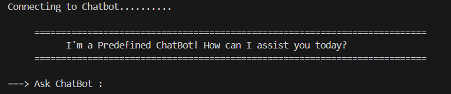
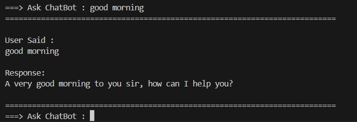
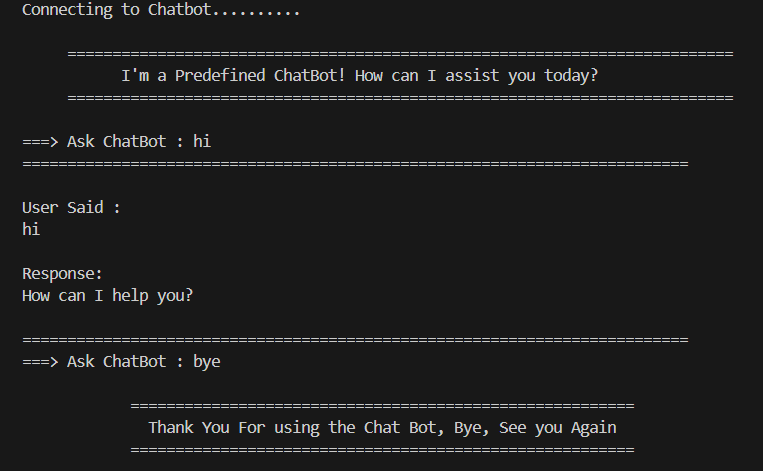

# Predefined ChatBot

Welcome to **Project 1** of the **DecodeLabs Virtual Internship** under the **AI Track**. This project is a lightweight, rule-based, predefined ChatBot written in Python. It interacts with users by matching their inputs against a local database of predefined commands and responses loaded from a JSON file.



---

## Key Features

- **Proper Code Structure** : This Project is maded by keeping the ethics of Programming And Code Structure and Uses Proper OOPs Based Code Structure

- **Dynamic Loading**: Responses are loaded dynamically from a JSON file (`predefined_responses.json`).

- **Input Normalization**: Smart matching that cleans whitespace, removes common punctuations (`?`, `!`, `.`), and handles inputs case-insensitively.

- **Dynamic Help Menu**: Prints an aligned list of all understood commands if you ask for `help`.

- **Predefined Commands**: Over 30+ default conversational, factual, and informative responses pre-loaded.

- **Graceful Shutdown**: Exit anytime by typing termination commands like `exit`, `quit`, `bye`, or `goodbye`.

---

## Project Structure

```text
PreDefined_ChatBot_DecodeLabs_Project1/
│
├── main.py                     # The core ChatBot application code and runner loop
├── Images/                      # Contains Images of the Terminal
├── predefined_responses.json   # JSON file containing predefined question-to-answer mappings
└── README.md                   # Project documentation and guide
```

---

## How to Use

### Prerequisites

To run this project, make sure you have Python 3 installed on your system.
You can verify it by running:
```bash
python --version
```

### Installation & Setup

1. **Clone the Repository** or navigate to the project directory:
   ```bash
   cd PreDefined_ChatBot_DecodeLabs_Project1
   ```

2. **Verify Files**:
   Ensure `main.py` and `predefined_responses.json` are present in the same directory.

### Running the ChatBot

Start the ChatBot by executing `main.py`:
```bash
python main.py
```

---

## Sample Interaction

Once running, you will be prompted to type your queries:

```text
Connecting to Chatbot..........

     ==========================================================================
           I'm a Predefined ChatBot! How can I assist you today?
     ==========================================================================

===> Ask ChatBot : hello
==========================================================================

User Said :
hello

Response:
Hello! How can I help you today?

==========================================================================
===> Ask ChatBot : help
==========================================================================
       This is a Predefined ChatBot.
       It Only Understand the Following Commands:

       hi                                : How can I help you?
       hello                             : Hello! How can I help you today?
       ... (List of all predefined commands) ...
```

>  

> 

---

## Customization

You can easily add or edit responses without changing any Python code:
1. Open the `predefined_responses.json` file.
2. Add a new key-value pair where the **key** is the lowercase command and the **value** is the response.
   ```json
   "what is artificial intelligence": "AI is the simulation of human intelligence processes by machines."
   ```
3. Restart the ChatBot, and the new command will automatically be recognized!
